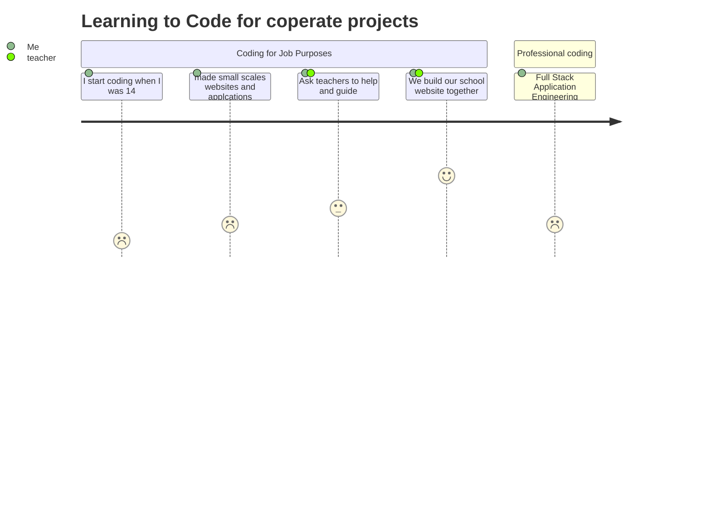

## Software Engineering Journey

```mermaid
journey
	title Learning to Code for coperate projects
	section Coding for Job Purposes
		I start coding when I was 14: 1: Me
		made small scales websites and applcations: 2: Me
		Ask teachers to help and guide: 3: Me, teacher
		We build our school website together: 5: Me, teacher
	section Professional coding
		Full Stack Application Engineering: 2: Me
```
